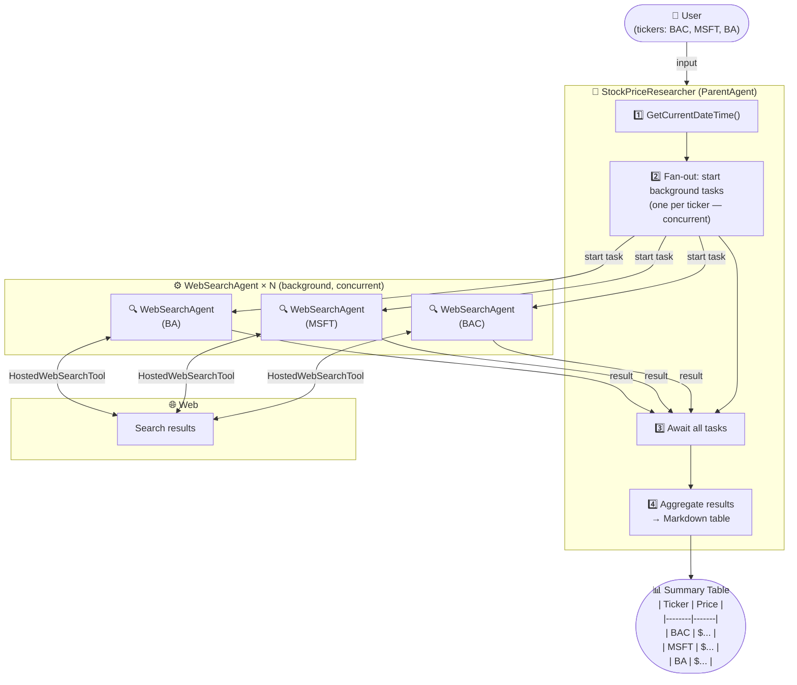

```mermaid
flowchart TD
    User(["👤 User\n(tickers: BAC, MSFT, BA)"])

    subgraph ParentAgent["🧠 StockPriceResearcher (ParentAgent)"]
        direction TB
        P1["1️⃣ GetCurrentDateTime()"]
        P2["2️⃣ Fan-out: start background tasks\n(one per ticker — concurrent)"]
        P3["3️⃣ Await all tasks"]
        P4["4️⃣ Aggregate results\n→ Markdown table"]
        P1 --> P2 --> P3 --> P4
    end

    subgraph Workers["⚙️ WebSearchAgent × N  (background, concurrent)"]
        direction LR
        W1["🔍 WebSearchAgent\n(BAC)"]
        W2["🔍 WebSearchAgent\n(MSFT)"]
        W3["🔍 WebSearchAgent\n(BA)"]
    end

    subgraph Web["🌐 Web"]
        S1["Search results"]
    end

    Result(["📊 Summary Table\n| Ticker | Price |\n|--------|-------|\n| BAC    | $...  |\n| MSFT   | $...  |\n| BA     | $...  |"])

    User -->|input| ParentAgent
    P2 -->|start task| W1
    P2 -->|start task| W2
    P2 -->|start task| W3
    W1 <-->|HostedWebSearchTool| S1
    W2 <-->|HostedWebSearchTool| S1
    W3 <-->|HostedWebSearchTool| S1
    W1 -->|result| P3
    W2 -->|result| P3
    W3 -->|result| P3
    P4 --> Result
```
